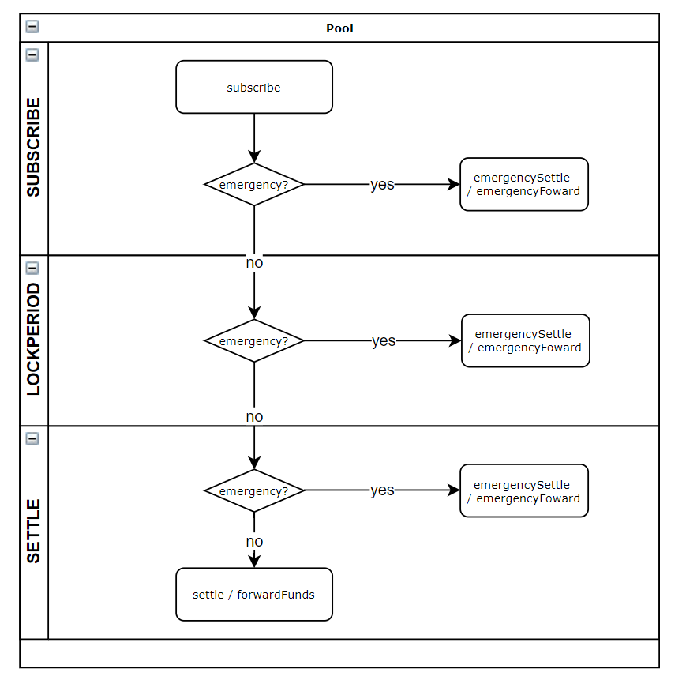

# mcb-crowdsale

## contracts

**contracts/MCBCrowdsale.sol**



MCBCrowdsale is a contract for MCB holders to pre-purchase future releasing MCB token. To buy 1 MCB token, the buy need to deposit 4x MCB token and 10x USDC.

If the total amount raised exceeds the target, the purchasers' share will decrease in equal proportion. The deposited MCB and the USDC in excess of the fundraising target can be fully withdrawn after unlock period.

The is a emergency switch to prevent unexpected loss. In the emergency state, user is able to take their deposited assets back.


**contracts/MCBVesting.sol**

MCBVesting is a contract to distribute MCB tokens to beneficiaries.

The releasing amount is based on current minted MCB token from `Minter` in MCDEX DAO.

The beneficiary can claim their token every time when the new minted MCB tokens put in, according to the shares then owned. All beneficiaries are preset and cannot be modified.

## install

```shell
npm install
npx hardhat compile
```

## run tests

```shell
npx hardhat test
```

## run coverage

```shell
npx hardhat coverage
```

## Token Address

| Name                  | Address                                                      |
| --------------------- | ------------------------------------------------------------ |
| MCB                   | [0x4e352cf164e64adcbad318c3a1e222e9eba4ce42](https://etherscan.io/token/0x4e352cf164e64adcbad318c3a1e222e9eba4ce42) |
| USDC                  | [0xa0b86991c6218b36c1d19d4a2e9eb0ce3606eb48](https://etherscan.io/token/0xa0b86991c6218b36c1d19d4a2e9eb0ce3606eb48) |
| MCDEX MultiSignWallet |                                                              |

## Reference
